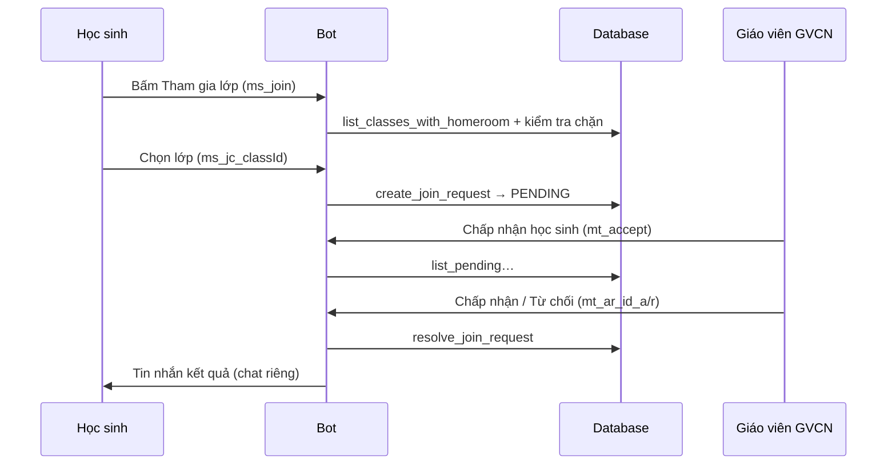

# Tài liệu phát triển & vận hành Bot Telegram

Tài liệu giúp **đọc lại sau này**, sửa logic hoặc thêm tính năng mà không phải đoán hành vi code.

---

## 1. Kiến trúc tổng quan

| Thành phần | Vai trò |
|------------|---------|
| `main.py` | FastAPI + khởi động/tắt bot (polling), `create_all` bảng DB |
| `database.py` | `SessionLocal`, `engine`, `Base` |
| `models.py` | ORM: `UserInfo`, `ClassInfo`, `RequestJoinClass`, … |
| `bot_handlers/services.py` | **Logic nghiệp vụ** (DB, không import `telegram.ext`) |
| `bot_handlers/bot_handlers.py` | **Handlers Telegram**: lệnh, callback, hội thoại, đăng ký handler |

**Nguyên tắc:** Sửa quy tắc “ai được vào lớp”, “cách duyệt” → chủ yếu sửa **`services.py`**. Sửa cách hiển thị tin nhắn, nút, thứ tự handler → **`bot_handlers.py`**.

---

## 2. Chạy bot cùng API (`main.py`)

- Trong **lifespan** FastAPI: gọi `init_db()` → `asyncio.create_task(run_telegram_bot())`.
- `run_telegram_bot()`: tạo `Application` với `TELEGRAM_BOT_TOKEN`, gọi `register_handlers(telegram_app)`, rồi `start_polling`.
- **Bắt buộc** có `TELEGRAM_BOT_TOKEN` trong `.env`; thiếu sẽ lỗi khi khởi động.

**Khi sửa handler:** restart process (uvicorn) để bot nạp lại code.

---

## 3. `bot_handlers/services.py` — Hàm nghiệp vụ

Tất cả hàm nhận **`db: Session`** (SQLAlchemy) trừ khi chỉ cần object Telegram.

### 3.1 `display_name_from_telegram(tg_user: User) -> str`

| Mục | Chi tiết |
|-----|----------|
| **Ý nghĩa** | Tạo chuỗi tên hiển thị mặc định khi tạo user mới từ Telegram (first + last name, hoặc `@username`, hoặc `"Người dùng"`). |
| **Tham số** | `tg_user`: object `telegram.User` từ update. |
| **Trả về** | Chuỗi tối đa 255 ký tự. |
| **Cách dùng** | Chỉ được gọi nội bộ từ `get_or_create_user` (không cần gọi trực tiếp từ handler trừ khi refactor). |

---

### 3.2 `get_or_create_user(db, tg_user: User) -> UserInfo`

| Mục | Chi tiết |
|-----|----------|
| **Ý nghĩa** | Đảm bảo có bản ghi `users` tương ứng Telegram: nếu `telegram_id` nằm trong **`tele_teacher_infos`** thì tạo/cập nhật **giáo viên** (`role=teacher`); không thì **học sinh** (`role=student`). |
| **Hành vi quan trọng** | • GV: nếu trước đó là HS, nâng lên GV và **`class_id = None`**. • Đồng bộ `username` khi đổi. • Có `commit`/`refresh` bên trong. |
| **Tham số** | `db`: session đang mở; `tg_user`: user Telegram. |
| **Trả về** | `UserInfo` sau khi commit. |
| **Cách dùng** | Gọi ở mọi handler cần biết “user trong DB là ai”: `/start`, `/menu`, callback menu, trước khi tạo yêu cầu vào lớp, v.v. Luôn dùng trong `with SessionLocal() as db:`. |

---

### 3.3 `update_student_full_name(db, tg_user, full_name: str) -> bool`

| Mục | Chi tiết |
|-----|----------|
| **Ý nghĩa** | Cập nhật `UserInfo.full_name` **chỉ khi** user là học sinh. |
| **Trả về** | `True` nếu đã lưu; `False` nếu không phải HS. |
| **Cách dùng** | Hội thoại đổi tên (ConversationHandler). Gọi sau khi đã có text hợp lệ từ HS. |

---

### 3.4 `list_classes_with_homeroom(db) -> list[ClassInfo]`

| Mục | Chi tiết |
|-----|----------|
| **Ý nghĩa** | Danh sách lớp **đã có** `homeroom_teacher_id` (có GVCN). Dùng cho màn “chọn lớp để xin vào”. |
| **Cách dùng** | Chỉ đọc DB; không commit. |

---

### 3.5 `student_join_block_reason(db, student: UserInfo) -> str | None`

| Mục | Chi tiết |
|-----|----------|
| **Ý nghĩa** | Kiểm tra HS **có được phép gửi yêu cầu vào lớp mới** không. |
| **Trả về** | • `None` = được phép. • Chuỗi tiếng Việt = lý do chặn (hiển thị cho user). |
| **Điều kiện chặn** | Không phải HS; đã có `class_id`; đã có bản ghi `RequestJoinClass` trạng thái **PENDING** (bất kỳ lớp nào). |
| **Cách dùng** | Gọi trước khi tạo `RequestJoinClass`. Dùng chung với `create_join_request` (bên trong đã gọi lại). |

---

### 3.6 `create_join_request(db, student: UserInfo, class_id: int) -> tuple[bool, str]`

| Mục | Chi tiết |
|-----|----------|
| **Ý nghĩa** | Tạo yêu cầu vào lớp ở trạng thái **pending** (chờ GVCN duyệt). |
| **Trả về** | `(True, thông_báo_thành_công)` hoặc `(False, thông_báo_lỗi)` — chuỗi đều có thể đưa thẳng vào `reply_text`. |
| **Kiểm tra** | Gọi `student_join_block_reason`; lớp phải tồn tại và có GVCN; không trùng pending cùng (student, class). |
| **Cách dùng** | Sau khi HS chọn một `class_id` từ inline keyboard. `student` phải là bản ghi đã sync trong cùng session (sau `get_or_create_user`). |

---

### 3.7 `list_pending_join_requests_for_homeroom_teacher(db, teacher_user_id: int) -> list[RequestJoinClass]`

| Mục | Chi tiết |
|-----|----------|
| **Ý nghĩa** | Tất cả yêu cầu **PENDING** mà lớp đó có `homeroom_teacher_id == teacher_user_id`. |
| **Trả về** | Đã `joinedload` `student` và `class_info` để bot in tên HS và tên lớp. |
| **Cách dùng** | Màn “Chấp nhận học sinh” cho GVCN. |

---

### 3.8 `resolve_join_request(db, request_id, teacher_user_id, approve: bool) -> tuple[bool, str, UserInfo | None, ClassInfo | None]`

| Mục | Chi tiết |
|-----|----------|
| **Ý nghĩa** | GVCN **duyệt** (`approve=True`) hoặc **từ chối** (`approve=False`) một yêu cầu. |
| **Khi duyệt** | Gán `student.class_id`; `RequestJoinClass.status = APPROVED`; tăng `ClassInfo.total_students`; các yêu cầu **PENDING khác** của cùng HS → **REJECTED**. |
| **Khi từ chối** | Chỉ đặt `RequestJoinClass.status = REJECTED`. |
| **Trả về** | • `(False, lỗi, None, None)` nếu không hợp lệ (không phải GVCN, đã xử lý, HS đã có lớp, …). • `(True, "", student, class_info)` nếu thành công — chuỗi rỗng: không cần báo lỗi cho GV; dùng `student`/`class_info` để gửi tin nhắn cho HS. |
| **Cách dùng** | Gọi từ handler callback sau khi parse `request_id` và xác định `approve`. Luôn trong một `with SessionLocal()`. |

---

## 4. `bot_handlers/bot_handlers.py` — Telegram & UI

### 4.1 Hằng số nút và `callback_data`

| Prefix / giá trị | Ý nghĩa |
|------------------|---------|
| `mt_*` | Menu **giáo viên** (ví dụ `mt_edit`, `mt_accept`). |
| `ms_*` | Menu **học sinh** (ví dụ `ms_join`, `ms_edit`). |
| `ms_jc_{id}` | HS **chọn lớp** `id` để gửi yêu cầu (khớp regex `^ms_jc_\d+$`). |
| `mt_ar_{request_id}_a` / `_r` | GV **Chấp nhận** / **Từ chối** yêu cầu có `id` trong bảng `request_join_classes`. |

**Giới hạn Telegram:** mỗi `callback_data` tối đa **64 byte** — giữ id số ngắn hoặc rút gọn nếu sau này đổi format.

---

### 4.2 Bàn phím inline

| Hàm | Trả về | Khi nào dùng |
|-----|--------|----------------|
| `teacher_menu_inline()` | `InlineKeyboardMarkup` | Menu GV: `/start`, `/menu`, làm mới menu. |
| `student_menu_inline()` | `InlineKeyboardMarkup` | Menu HS. |

---

### 4.3 Các handler async (theo thứ tự ý nghĩa)

#### `_reply_or_edit_menu(update, context, *, text, reply_markup)`

- Gửi menu: nếu có `callback_query` thì ưu tiên **sửa tin** (`edit_message_text`); lỗi `BadRequest` (tin cũ/trùng) thì **gửi tin mới**.
- Nếu là tin nhắn thường → `reply_text`.

#### `send_role_menu(update, context)`

- `/menu` hoặc callback `ms_menu`: gọi `get_or_create_user`, chọn menu GV hoặc HS tương ứng.

#### `handle_student_join_classes(update, context)`

- Callback **`ms_join`**: kiểm tra HS, `student_join_block_reason`, lấy `list_classes_with_homeroom`, gửi danh sách nút `ms_jc_{class_id}`.

#### `on_student_pick_class(update, context)`

- Pattern **`^ms_jc_\d+$`**: parse `class_id`, `create_join_request`, trả lời bằng chuỗi `(ok, msg)`.

#### `handle_teacher_pending_join_list(update, context)`

- Callback **`mt_accept`**: chỉ GV, `list_pending_join_requests_for_homeroom_teacher`, mỗi yêu cầu một hàng nút `mt_ar_{id}_a|r`.

#### `on_teacher_join_resolve(update, context)`

- Pattern **`^mt_ar_\d+_[ar]$`**: gọi `resolve_join_request`, gửi tin nhắn riêng cho HS (`chat_id=int(student.telegram_id)`), báo GV “Đã xử lý”.

#### `student_edit_name_start` / `student_edit_name_receive` / `student_edit_name_cancel`

- **ConversationHandler** đổi tên HS (entry: callback `ms_edit`). State `WAITING_STUDENT_FULL_NAME = 1`.
- Fallback: `/cancel`, `/start`, `/menu` → thoát hội thoại.

#### `start_command(update, context)`

- `/start`: chào + menu theo role.

#### `on_menu_button(update, context)`

- Xử lý callback bắt đầu bằng `mt_` hoặc `ms_` **không** thuộc handler chuyên biệt ở trên.
- **Phân nhánh sớm:** `ms_menu` → `send_role_menu`; `ms_join` → `handle_student_join_classes`; `mt_accept` → `handle_teacher_pending_join_list`.
- Các nút khác: placeholder “tính năng sẽ triển khai sau” hoặc cảnh báo sai role (GV bấm nút `ms_*`, HS bấm `mt_*`).

---

### 4.4 `register_handlers(app)` — Thứ tự **quan trọng**

Handlers được thêm **từ trên xuống**; update được xử lý bởi handler **khớp đầu tiên**.

1. `CallbackQueryHandler(on_student_pick_class, pattern=r"^ms_jc_\d+$")`
2. `CallbackQueryHandler(on_teacher_join_resolve, pattern=r"^mt_ar_\d+_[ar]$")`
3. `ConversationHandler` (đổi tên)
4. `CommandHandler("start" / "menu")`
5. `CallbackQueryHandler(on_menu_button, pattern=r"^(mt_|ms_)")`

**Lý do:** `ms_jc_*` và `mt_ar_*` cũng bắt đầu bằng `ms_` / `mt_`. Nếu để handler menu chung trước, callback có thể bị xử lý sai. **Luôn** giữ hai handler cụ thể **trước** `on_menu_button`.

---

## 5. Luồng nghiệp vụ: Tham gia lớp

**Bảng liên quan:** `request_join_classes` (`RequestJoinClass`), `users`, `classes`.

---

## 6. Model `RequestJoinClass` (tham khảo)

- `status`: enum `RequestJoinClassStatus` — `pending`, `approved`, `rejected`.
- Quan hệ: `student` → `UserInfo`, `class_info` → `ClassInfo`.

Sửa quy tắc trạng thái → cập nhật **`services.resolve_join_request`** và migration DB nếu đổi enum/cột.

---

## 7. Gợi ý khi sửa / mở rộng

| Việc cần làm | Nơi chỉnh |
|----------------|-----------|
| Đổi điều kiện “được xin vào lớp” | `student_join_block_reason`, `create_join_request` |
| Đổi nội dung tin nhắn cho HS/GV | `bot_handlers.py` (handler tương ứng) |
| Thêm nút menu mới | Hằng số `CB_*`, `teacher_menu_inline` / `student_menu_inline`, xử lý trong `on_menu_button` hoặc handler riêng |
| Thêm callback mới có prefix trùng `mt_`/`ms_` | Đăng ký **trước** `on_menu_button` nếu pattern có thể bị nuốt nhầm |
| HS đổi lớp sau khi đã vào lớp | Cần luồng mới (hủy lớp, admin, …) — hiện chưa có |

---

## 8. API Admin (tách biệt bot)

Quản lý lớp, GVCN, whitelist GV: xem **`ADMIN_API.md`** và `app/api/admin.py`. Bot chỉ đọc/ghi DB qua `services.py`; không gọi HTTP admin từ bot trong phiên bản hiện tại.

---

*Tài liệu này phản ánh code tại thời điểm viết; khi refactor, nên cập nhật lại mục tương ứng.*
